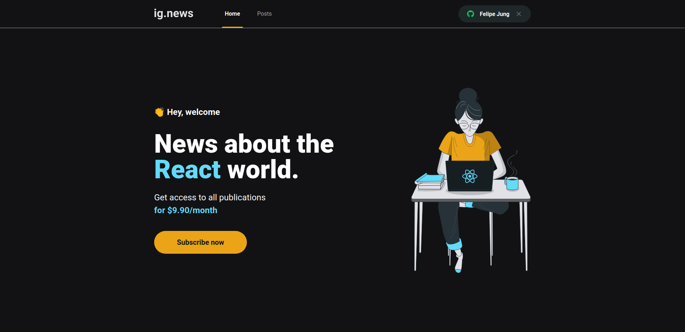

<h1 align="center">
    
    <br>
    Ignite - React - Ignews
</h1>

<h4 align="center">
  News about the React world.
</h4>



## :rocket: Technologies

- [React.js](https://reactjs.org/)
- [Next.js](https://nextjs.org)
- [Prismic](https://prismic.io)
- [FaunaDB](https://fauna.com)
- [Stripe](https://stripe.com)
- [Sass](https://sass-lang.com)

## :information_source: How To Use

```bash
git clone https://github.com/felipe-jm/ignite-react-ignews.git

cd ignite-react-ignews

# Create your .env.local file in the root and populate it with the necessary enviromental variables

yarn

yarn dev
```

## :memo: License

This project is under the MIT license. See the [LICENSE](https://github.com/felipe-jm/ignite-react-ignews/blob/master/LICENSE) for more information.

---

Made with much :heart: and :muscle: by Felipe Jung :blush: <a href="https://www.linkedin.com/in/felipe-jung/">Talk to me!</a>
